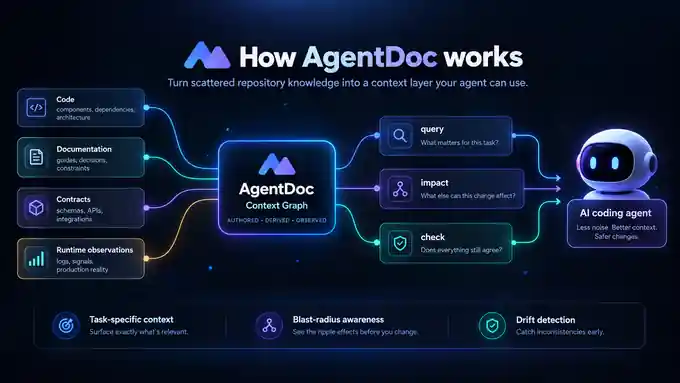

# AgentDoc


**Give coding agents the context they actually need.**

AgentDoc turns your codebase, docs, contracts, and runtime evidence into a context layer your coding agent can query before it changes anything.

[](https://www.npmjs.com/package/agent-doc-system) [](LICENSE) [](https://nodejs.org/)

## Give this to your coding agent

Paste this into your agent **from the repository you want to use AgentDoc on**:

```text
Set up AgentDoc for this repository and use it as the context layer for your work.

AgentDoc: https://github.com/lbframe/agent-doc-system

1. Read INSTALL_FOR_AGENTS.md and install or upgrade the AgentDoc CLI.
2. Read skills/agent-doc-system/SKILL.md.
3. Run agentdoc doctor --project and agentdoc audit.
4. Use the appropriate CREATE or MIGRATE workflow for this repository.
5. Do not invent ownership, architecture, authority rules, or product intent. Ask me only for decisions AgentDoc cannot safely derive.
6. Finish setup with agentdoc validate, agentdoc compile, and agentdoc check.
7. From now on, use agentdoc query and agentdoc impact before changes, then agentdoc check after changes.
8. Report anything unresolved or conflicting instead of guessing.
```

That is the intended onboarding path: **give the prompt to the agent, let AgentDoc build the context layer, and keep using it during development.**

## Why AgentDoc?

Coding agents can read code. The hard part is knowing **what matters for this change**.

Important context is scattered across code, documentation, API contracts, architectural decisions, CI rules, and production reality. Agents either load too much or miss something important.

AgentDoc gives them a map.

- **Query the right context** for a file or component.
- **See the blast radius** before changing code.
- **Detect drift** between code and documentation.
- **Surface conflicts** instead of silently guessing.
- **Verify constraints in CI** before stale knowledge becomes trusted context.


## Three commands, one workflow

```bash
agentdoc query src/payments/webhook.ts
agentdoc impact src/payments/webhook.ts
agentdoc check
```

`query` tells the agent what it needs to know. `impact` shows what the change can affect. `check` verifies that the repository still agrees with itself.

## Why not just AGENTS.md or RAG?


AgentDoc is not another documentation file and it is not just semantic search.

It combines **authored intent**, **facts derived from code**, and **runtime observations** without pretending they are the same thing. When sources disagree, AgentDoc surfaces the conflict instead of choosing a convenient answer.

## How it works



AgentDoc compiles repository knowledge into a deterministic context graph that coding agents can query on demand.

The result: less context to load, better awareness of dependencies and constraints, and a verification step after every change.

## Install manually

Requires Node.js 22+.

```bash
npm install -g agent-doc-system
agentdoc doctor
```

Then, inside a repository:

```bash
agentdoc audit
```

AgentDoc also ships with an Agent Skill at [`skills/agent-doc-system/`](skills/agent-doc-system/SKILL.md).

## Documentation

- [Getting started & migration](docs/MIGRATION.md)
- [Authority & conflicts](docs/AUTHORITY.md)
- [CI & verification](docs/CI.md)
- [Specification](docs/SPEC.md)
- [Agent Skill](skills/agent-doc-system/SKILL.md)

## License

[MIT](LICENSE) © 2026 lbframe
